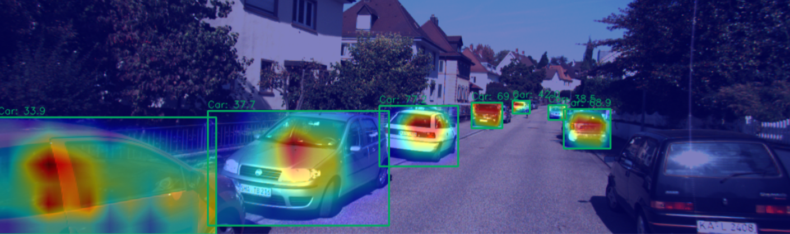

# tc2d3d

<p align="center">
  
</p>

<h1></h1>

> 2D/3D Tight Constraint for Monocular General-Purpose 3D Object Detection

## Usage

```sh
# Clone MMDetection3D
git clone https://github.com/open-mmlab/mmdetection3d.git
# Clone TC2D3D to the correctly named directory in the projects folder
git clone https://github.com/josugoar/tc2d3d.git projects/TC2D3D
```

## [Weights](https://drive.google.com/drive/folders/1ce1w8c4vzSpj-GNz3PPrfdEepjvrQQDm?usp=sharing)

> [!NOTE]  
> Please note that the availability of the weights is not guaranteed. The weights may become unavailable or inactive at any time without notice.
